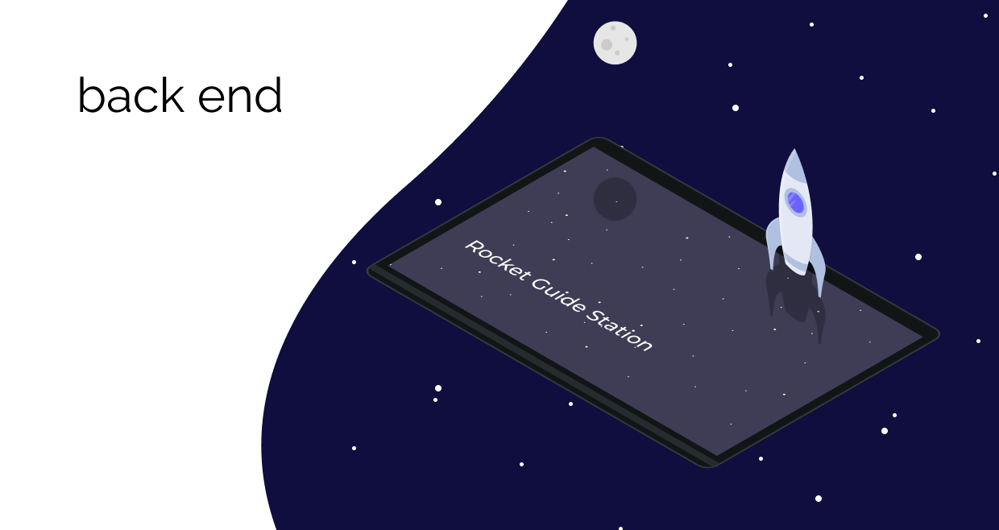

Repositório utilizado para manter o projeto do back end do projeto rgs

[](https://opensource.org/licenses/MIT)

## Documentação

A documentação do projeto está disponível no repositório está disponível [AQUI!](https://github.com/Ground-Station/Documentation)

## Uso

Para executar e usar o front end do projeto, basta executar o docker-compose na pasta raiz do projeto com o comando:
```
$sudo docker-compose up --build
```
